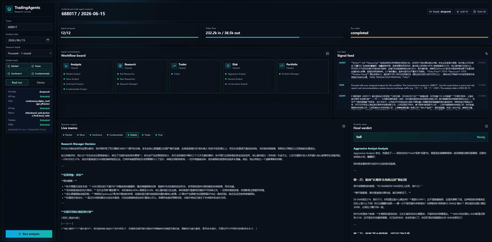
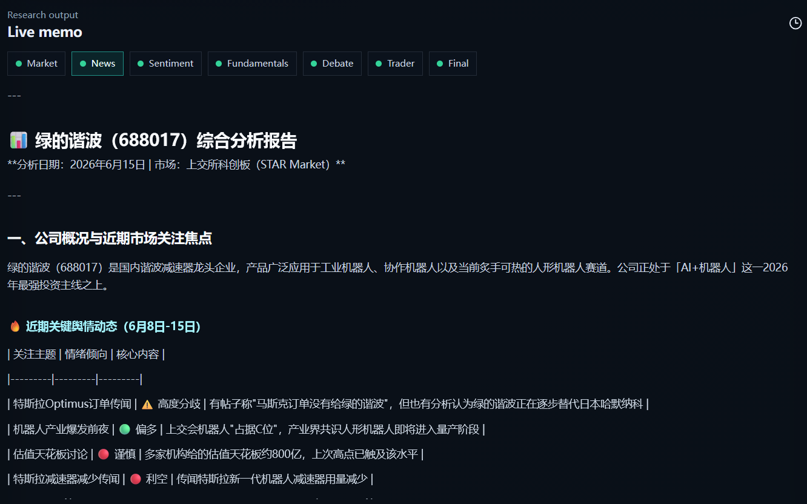
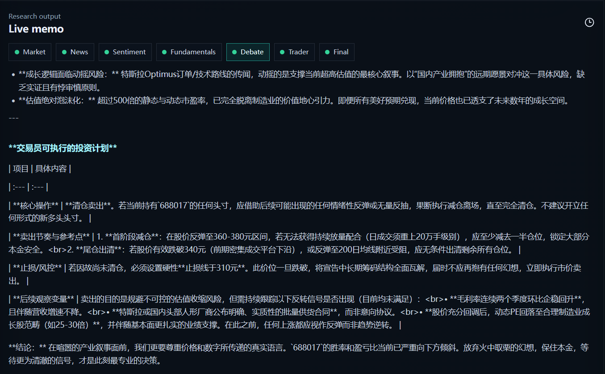
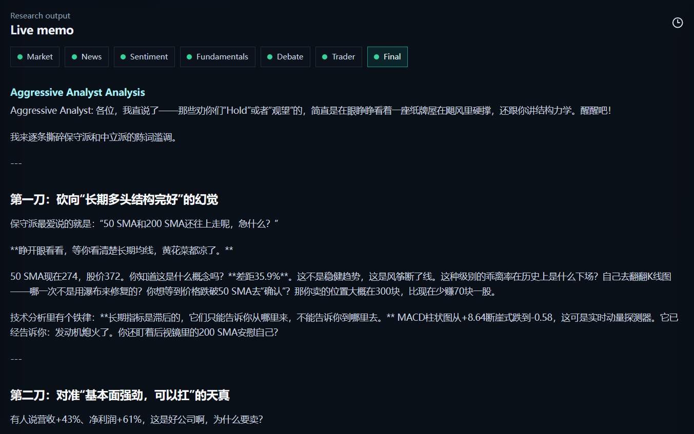

# TradingAgents A 股研究控制台

本仓库基于 [TauricResearch/TradingAgents](https://github.com/TauricResearch/TradingAgents) 改造，加入了本地网页控制台、A 股数据源适配和中国宏观利率数据兜底。目标是让多智能体金融研究流程不只停留在命令行里，而是可以在浏览器中实时看到每个分析员、研究员、交易员和风控角色的推理过程。

> 本项目用于研究和学习，不构成任何投资建议。模型输出会受到数据质量、API 稳定性、提示词和大模型随机性的影响。

<p align="center">
  
</p>

## 这个版本做了什么

- 新增本地 Web 控制台，支持在浏览器里查看工作流进度、Token 消耗、工具调用、实时消息流和最终交易建议。
- 针对 A 股做了数据源改造，优先使用东方财富公开数据，减少对海外站点的依赖。
- 接入东方财富股吧、个股新闻和 F10 信息，用于新闻、情绪面和基本面分析。
- 接入中债网页源作为中国收益率曲线优先来源，获取不到时会给出温和的数据缺口说明，而不是直接让整轮分析报错。
- 保留 Alpha Vantage、yfinance、FRED、Tushare 等可选数据源作为补充或兜底。
- 支持 DeepSeek 等 LLM Provider，并在网页侧展示 API key 是否已检测到，但不会展示具体密钥。

## 实际界面

### 研究备忘录

多智能体会把市场、新闻、情绪、基本面、辩论、交易员和最终结论分阶段写入 Live memo，方便回看分析链路。

<p align="center">
  
</p>

### 多空辩论与交易计划

研究团队会对同一标的形成多空视角，交易员再把争论压缩成可执行计划，包括核心动作、卖出节奏、止损和后续观察变量。

<p align="center">
  
</p>

### 风控视角

风险角色会从激进、中性、保守视角审视交易方案，输出更接近真实投研会议的反方观点和风险提示。

<p align="center">
  
</p>

## 数据源

| 模块 | 默认来源 | 说明 |
| --- | --- | --- |
| A 股行情 | 东方财富 | 优先用于日线行情、技术指标和市场快照 |
| A 股新闻 | 东方财富个股新闻、股吧 | 用于新闻面和情绪面分析 |
| A 股基本面 | 东方财富 F10 | 用于公司概况和关键财务指标 |
| 中国宏观利率 | 中债网页源 | 优先获取人民币国债收益率曲线 |
| 海外宏观 | FRED | 配置 `FRED_API_KEY` 后启用 |
| 补充行情 | Alpha Vantage、yfinance | A 股不稳定时作为兜底，不保证覆盖全部中国股票 |
| 可选付费源 | Tushare Pro | 默认不启用新闻接口，除非你明确配置并拥有对应权限 |

如果公开网页源临时不可用，系统会尽量把问题记录为“数据缺口”，避免因为单个数据源失败导致整轮多智能体工作流中断。

## 快速开始

### 1. 克隆仓库

```powershell
git clone https://github.com/1earner0327/TradingAgents.git
cd TradingAgents
git checkout codex/a-share-web-console
```

### 2. 准备 Python 环境

```powershell
python -m venv .venv
.\.venv\Scripts\Activate.ps1
pip install -e .
```

### 3. 安装网页依赖

```powershell
cd web
npm install
cd ..
```

### 4. 配置 API key

复制示例文件：

```powershell
Copy-Item .env.example .env
```

最少需要填写一个大模型 key。当前推荐使用 DeepSeek：

```env
DEEPSEEK_API_KEY=
TRADINGAGENTS_LLM_PROVIDER=deepseek
TRADINGAGENTS_DEEP_THINK_LLM=deepseek-v4-pro
TRADINGAGENTS_QUICK_THINK_LLM=deepseek-v4-pro
TRADINGAGENTS_DATA_VENDOR_CHAIN=eastmoney,alpha_vantage,yfinance
TRADINGAGENTS_MACRO_VENDOR_CHAIN=chinabond_web,tushare,fred,local_note
TRADINGAGENTS_ENABLE_TUSHARE_NEWS=0
```

可选 key：

| Key | 用途 | 获取地址 |
| --- | --- | --- |
| `DEEPSEEK_API_KEY` | 大模型推理 | <https://platform.deepseek.com/> |
| `ALPHA_VANTAGE_API_KEY` | 可选行情兜底 | <https://www.alphavantage.co/support/#api-key> |
| `FRED_API_KEY` | 美国宏观数据 | <https://fred.stlouisfed.org/docs/api/api_key.html> |
| `TUSHARE_TOKEN` | 可选付费数据源 | <https://tushare.pro/> |

`.env` 已经被 `.gitignore` 忽略，不要把真实 API key 提交到 GitHub。

### 5. 启动网页控制台

```powershell
.\start_tradingagents_web.cmd
```

启动后浏览器访问：

```text
http://127.0.0.1:5173
```

## 使用方式

1. 在左侧输入股票代码，例如 `688017`、`300308`。
2. 选择分析日期和研究深度。
3. 勾选 Market、News、Sentiment、Fundamentals 等分析桌。
4. 点击 `Run analysis`。
5. 在右侧 Signal feed 观察工具调用和智能体消息。
6. 在 Live memo 中切换不同阶段，查看完整分析过程。
7. 在 Final verdict 中查看最终交易建议。

## 稳定性说明

- 中国大陆网络环境下，东方财富和中债网页源通常比 Yahoo Finance、Reddit、StockTwits、FRED 等海外源更稳定。
- 免费公开接口可能变更字段、限频或临时不可用，因此项目保留了多数据源 fallback。
- Tushare 的部分新闻和高阶接口需要付费权限，本版本默认关闭 Tushare 新闻，避免无权限时报错。
- 如果宏观数据拿不到，系统会把它写成数据缺口说明，不会再因为单个宏观工具失败而终止整轮分析。

## 项目结构

```text
web/                         本地网页控制台和后端服务
tradingagents/dataflows/     行情、新闻、情绪、宏观和基本面数据适配
cli/                         原命令行交互入口
start_tradingagents_web.cmd  Windows 一键启动脚本
README_A_SHARE_WEB.md        A 股网页版本的简要配置说明
```

## 和上游项目的关系

TradingAgents 原项目是一个多智能体金融交易研究框架，通过 Analyst、Researcher、Trader、Risk、Portfolio Manager 等角色模拟投研团队的协作。本 fork 保留原有框架，同时加入更适合 A 股研究和本地演示的网页体验。

上游项目：

- GitHub: <https://github.com/TauricResearch/TradingAgents>
- Technical Report: <https://arxiv.org/abs/2412.20138>

## 免责声明

本项目输出仅用于研究、学习和系统演示，不构成投资建议、交易建议或收益承诺。任何真实投资决策都应结合正式数据源、公司公告、交易所披露和个人风险承受能力独立判断。
